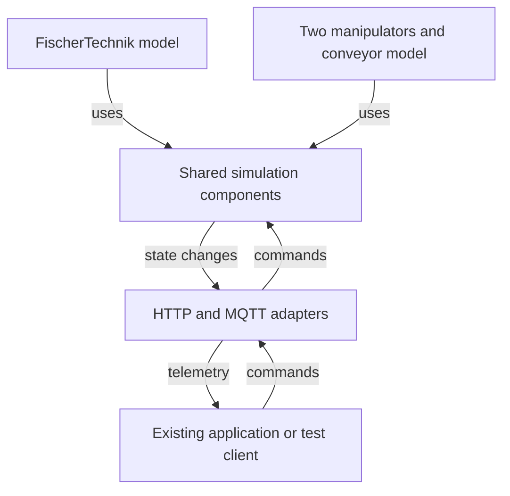

# Design

Working design for team and supervisor review. These initial choices guide the
first implementation and have not yet been validated in code. See the
[scope proposal](scope-proposal.md) for the rationale and decisions to confirm.

## Goal and reference layouts

Refactor the existing [FischerTechnik simulator](https://github.com/sejmasijaric/edpo-project/tree/main/factory-simulator)
into a reusable Java platform while preserving its functionality.

1. **FischerTechnik:** migrate the existing simulation and preserve the
   application-facing HTTP/MQTT behaviour.
2. **Two manipulators and a conveyor:** model one complete transfer route from
   an input through both manipulators and the conveyor to an output.

The separate sensor/controller IoT-lab model is deferred for now. Confirm whether
the second factory layout has a physical counterpart or is a representative model.

## Overview

Begin with one simulator application with clear internal boundaries. Factory
modules assemble shared components and provide specialised behaviour. Additional
machines can use Java code through documented interfaces.

## Responsibilities

| Part | Responsibility |
| --- | --- |
| Shared simulation components | Track workpieces and machine state, manage transfers, schedule actions, and provide scenario hooks. |
| Factory model | Define machine behaviour, valid states, transfer routes, fault effects, and the meaning of commands and telemetry. |
| HTTP/MQTT adapters | Translate external messages and internal actions. Keep protocol-specific details outside the shared simulation logic. |
| Configuration | Supply machine IDs, initial values, durations, supported connections, and scenario settings. Validate references and values. |

Reuse existing state, transport, configuration, and communication code where
suitable. Let the two reference models guide shared interfaces. Keep
factory-specific names and sensor mappings in the corresponding factory module.

Represent physical connections initially as explicit allowed transfers between
named points. Keep communication endpoints in adapter settings. More general
graph models and runtime plugin loading are outside the initial design.

## Initial timing decision

**The first implementation uses real elapsed time with configurable durations.**

A transport with a duration of three seconds starts when the command arrives,
keeps the machine busy, and completes after approximately three real seconds.
The application receives the expected state and telemetry updates.

Use one shared scheduling abstraction for delayed actions and scenario triggers.
Machine behaviour requests a later action through this abstraction. The runtime
uses standard Java scheduling facilities. This provides ordinary real-time
pacing with timing tolerances, rather than hard real-time guarantees.

Unit tests use a controllable scheduler to trigger pending actions directly.
This is a test helper. An accelerated production simulation clock and
synchronisation between multiple time modes are outside the initial scope.

Preserve existing HTTP response timing and MQTT publication behaviour during
migration. Process state changes in a controlled order and define the handling
of commands received while a machine is busy. A reset or fault must not allow an
obsolete completion action to move a workpiece afterwards.

Use fixed durations and explicit scenario triggers initially. Controlled tests
check relevant event order and final state. Integration tests allow timing
tolerances and variable timestamps. Bit-for-bit identical live telemetry logs
are not an acceptance criterion.

## Scenarios

| Scenario | Defined effect |
| --- | --- |
| Normal operation | Complete the reference production or transfer flow. |
| Delay | Apply a configured longer duration to a selected action. |
| Machine fault | Fail a specified action before it moves a workpiece, with a model-defined response. |
| Communication fault | Suppress selected outgoing telemetry during a defined interval. |

Use explicit triggers, such as an action number or elapsed time after scenario
start. Preserve existing supported failure behaviour during migration. Define
clear/reset behaviour and check that workpieces remain consistent. Automated
repair strategies, random failure distributions, and arbitrary network failure
simulation are deferred.

## Migration and implementation sequence

1. Run the existing simulator and record its functionality, HTTP responses,
   MQTT messages, and representative successful and failed flows.
2. Select baseline tests and define acceptance criteria before changing behaviour.
3. Extract one reusable machine/transport path and the timing boundary. Check it
   through the existing communication path early.
4. Migrate the remaining FischerTechnik behaviour incrementally and rerun the
   relevant baseline tests.
5. Assemble the second layout from shared components and its own factory module.
   Exercise a small part early to expose factory-specific assumptions.
6. Complete scenario tests, document extension tasks, and evaluate the result.

Agree on packaging and how the existing application starts the extracted
platform. Reuse the existing UI where practical. Propose a small test client for
the second layout and confirm the expected demonstration with the supervisors.

## Evaluation

| Question | Evidence |
| --- | --- |
| Is existing functionality preserved? | Baseline flows and HTTP/MQTT contract checks before and after migration. |
| Does the second layout work? | A complete transfer flow and agreed fault scenarios. |
| Are the models internally consistent? | Checks for valid states, occupied destinations, and workpiece conservation. |
| Which components are reused? | Map components used by both models and explain any duplication. |
| Is the platform easier to maintain and extend? | Document changes needed to adjust a duration, add an existing machine type, and alter a connection. Explain any changes to the core. |

Compare selected behaviour with available hardware observations, documentation,
or recorded messages. Passing old simulator tests establishes continuity, not
physical accuracy by itself. Validate a purely representative second model
against agreed behaviour rules and state the lack of hardware comparison.

The report covers requirements and relevant literature, design choices,
implementation, test results, qualitative architectural evaluation, and limits.
Provide run instructions, example scenarios, and an extension guide.

## Optional coding-agent demonstration

Use the extension guide, example code, and tests with an existing coding agent to
attempt one small extension. Review the result and record manual corrections.
This is optional after the main deliverables. A custom agent UI and automatic
support for arbitrary laboratories are outside the initial scope.

## Questions for kickoff

- Which existing behaviours and interface details define compatibility?
- Does the real-time timing approach meet the expected simulation fidelity?
- What transfer flow and physical reference define the second layout?
- Are the proposed fault scenarios and explicit reset behaviour sufficient?
- What evidence is required for validation and architectural evaluation?
- Can the separate IoT-lab model remain deferred and the agent demonstration optional?

Confirm the reference layouts and acceptance criteria with the supervisors before
implementation. Finalise Java interfaces and the small configuration schema as
the first migrated flow reveals concrete needs.
