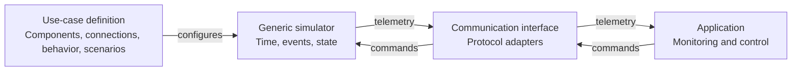

# Design

This is the proposed design for a later Java implementation.

## Overview



The use-case definition describes the system being simulated, such as a factory
or an IoT lab. The generic simulator runs it. The application communicates through
an interface compatible with the real system.

## Responsibilities

| Part | Responsibility |
| --- | --- |
| Simulation core | Start and stop runs, advance time, schedule events, manage state and connections, execute scenarios. |
| Use case | Define components, behavior, valid states, fault effects, and message meaning. |
| Adapters | Translate external commands and telemetry between the core and protocols such as MQTT or REST. The first protocol is undecided. |

Configuration describes components, connections, initial values, timing, and
scenario schedules. Code implements behavior rules, calculations, and protocol
translation. The configuration format and Java interfaces are still undecided.

## Execution

The engine uses discrete-event simulation:

1. Take the next event from the queue.
2. Advance simulation time to its timestamp.
3. Run the target component's behavior and update its state.
4. Publish any output and schedule follow-up events.
5. Repeat until the run ends.

Logical time, independent of wall-clock time, is the proposed default. Rules for
events with equal timestamps and repeatable randomness still need to be defined.
Real-time synchronization is an optional extension.

A component has an identity, type, properties, state, connections, and behavior.
Separating these responsibilities is proposed; the exact interfaces are open.
A machine might move from `idle` to `running` after a start command, then to
`failed` after a fault. Those states and transitions belong to the use case.

Connections form a graph with typed edges. A physical route and a communication
link can represent different relationships between the same components. Whether
they share one graph or use separate graphs is undecided.

A scenario schedules actions against components or connections. For example:

```text
 t=10: delay a machine
 t=35: fail a sensor
 t=50: recover the sensor
```

The engine schedules the actions. The use case defines their effects and recovery
rules. Telemetry should expose events and state changes for inspection.

## Validation

The planned demonstrations are:

- **Factory:** machines and conveyors with processing times, delays, and failures.
- **IoT lab:** devices, a broker, and a controller with measurement and communication cycles.

Both must run on the same core. Adding the second model should require only use-case
code, configuration, and any required adapters. Fixed inputs should produce
repeatable results, including fault and recovery scenarios.

## Open questions

Before implementation:

- What is the minimum component and behavior interface, and who validates state transitions?
- Must every interaction pass through the event queue, or can local updates happen directly?
- What time resolution, equal-time event ordering, and random seed rules make runs repeatable?
- How are physical layout and communication links represented and distinguished?
- Which fault operations are shared, and which belong entirely to use cases?
- How do external commands enter simulation time, and does the first demonstration need real-time synchronization?
- What concrete examples and acceptance criteria will validate reuse across the two use cases?

During implementation, settle the configuration schema and validation, event and
telemetry payload types, adapter contracts, and the exact boundary between
configurable behavior and custom code.
